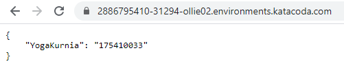

# TCC UAS
Yoga Kurnia Subekti  
175410033

## KUBERNETES  
### Membuat sebuah Deployment menggunakan Python+Flask
Pod dalam Kubernetes adalah kumpulan dari satu atau banyak Container yang saling terhubung untuk kebutuhan administrasi dan jaringan. Deployment dalam Kubernetes selalu memeriksa kesehatan Pod dan melakukan restart saat Kontainer di dalam Pod tersebut mati. Deployment digunakan untuk membuat dan mereplikasi Pod.  

Menggunakan perintah kubectl create untuk membuat Deployment. Pod menjalankan Container berdasarkan image docker yang digunakan. Disini saya menggunakan image docker yogaks1234/yogaks:v1 (image ini saya buat pada pertemuan 8, yang telah saya push ke Docker Hub). Pada Deployment ini Pod hanya memiliki 1 Container saja. 

Buka https://kubernetes.io/docs/tutorials/hello-minikube/ lalu Launch Terminal Minikube Cluster 

Your Interactive Learning Environment Bash Terminal  
start.sh  
$  
$ start.sh  
Starting Kubernetes...minikube version: v1.6.2
commit: 54f28ac5d3a815d1196cd5d57d707439ee4bb392
* minikube v1.6.2 on Ubuntu 18.04
* Selecting 'none' driver from user configuration (alternates: [])
* Running on localhost (CPUs=2, Memory=2461MB, Disk=47990MB) ...
* OS release is Ubuntu 18.04.3 LTS
* Preparing Kubernetes v1.17.0 on Docker '18.09.7' ...
  - kubelet.resolv-conf=/run/systemd/resolve/resolv.conf
* Pulling images ...
* Launching Kubernetes ...
* Configuring local host environment ...
* Done! kubectl is now configured to use "minikube"
* dashboard was successfully enabled
Kubernetes Started  

### $ mkdir yogaks  
### $ cd yogaks/  
### $ nano app.py 

    from flask import Flask  
    from flask_restful import Resource, Api

    app = Flask(__name__)  
    api = Api(app)

    class HelloWorld(Resource):  
        def get(self):  
            return {'YogaKurnia': '175410033'}  

    api.add_resource(HelloWorld, '/')  

    if __name__ == '__main__':  
        app.run(debug=True, host='0.0.0.0')

### $ nano requirements.txt  

    flask  
    flask_restful  

### $ nano Dockerfile  

    FROM python:2.7  
    COPY . /app  
    WORKDIR /app  
    RUN pip install -r requirements.txt  
    ENTRYPOINT ["python"]  
    CMD ["app.py"]  
### $ docker build -t yogaks1234/yogaks:v1 .  
Sending build context to Docker daemon  4.096kB
Step 1/6 : FROM python:2.7
2.7: Pulling from library/python
8f0fdd3eaac0: Pull complete
d918eaefd9de: Pull complete
43bf3e3107f5: Pull complete
27622921edb2: Pull complete
dcfa0aa1ae2c: Pull complete
ef6ca6913068: Pull complete
a755ea00feee: Pull complete
74b6f9ff9fd6: Pull complete
bebb4b693476: Pull complete
Digest: sha256:9517f5314968111658d229ed3038630a174e7a4f1b852bd185b70f614dffba08
Status: Downloaded newer image for python:2.7
 ---> 426ba9523d99
Step 2/6 : COPY . /app
 ---> c01750df5fcf
Step 3/6 : WORKDIR /app
 ---> Running in 632fd52dcf29
Removing intermediate container 632fd52dcf29
 ---> 4dfbb2acb304
Step 4/6 : RUN pip install -r requirements.txt
 ---> Running in 310ad5fd491b
DEPRECATION: Python 2.7 will reach the end of its life on January 1st, 2020. Please upgrade your Python as Python 2.7 won't be maintained after that date. A future version of pip will drop support for Python 2.7. More details about Python 2 support in pip, can be found at https://pip.pypa.io/en/latest/development/release-process/#python-2-support
Collecting flask
  Downloading https://files.pythonhosted.org/packages/9b/93/628509b8d5dc749656a9641f4caf13540e2cdec85276964ff8f43bbb1d3b/Flask-1.1.1-py2.py3-none-any.whl (94kB)
Collecting flask_restful
  Downloading https://files.pythonhosted.org/packages/17/44/6e490150ee443ca81d5f88b61bb4bbb133d44d75b0b716ebe92489508da4/Flask_RESTful-0.3.7-py2.py3-none-any.whl
Collecting itsdangerous>=0.24
  Downloading https://files.pythonhosted.org/packages/76/ae/44b03b253d6fade317f32c24d100b3b35c2239807046a4c953c7b89fa49e/itsdangerous-1.1.0-py2.py3-none-any.whl
Collecting Jinja2>=2.10.1
  Downloading https://files.pythonhosted.org/packages/65/e0/eb35e762802015cab1ccee04e8a277b03f1d8e53da3ec3106882ec42558b/Jinja2-2.10.3-py2.py3-none-any.whl (125kB)
Collecting click>=5.1
  Downloading https://files.pythonhosted.org/packages/fa/37/45185cb5abbc30d7257104c434fe0b07e5a195a6847506c074527aa599ec/Click-7.0-py2.py3-none-any.whl (81kB)
Collecting Werkzeug>=0.15
  Downloading https://files.pythonhosted.org/packages/ce/42/3aeda98f96e85fd26180534d36570e4d18108d62ae36f87694b476b83d6f/Werkzeug-0.16.0-py2.py3-none-any.whl (327kB)
Collecting aniso8601>=0.82
  Downloading https://files.pythonhosted.org/packages/eb/e4/787e104b58eadc1a710738d4e418d7e599e4e778e52cb8e5d5ef6ddd5833/aniso8601-8.0.0-py2.py3-none-any.whl (43kB)
Collecting pytz
  Downloading https://files.pythonhosted.org/packages/e7/f9/f0b53f88060247251bf481fa6ea62cd0d25bf1b11a87888e53ce5b7c8ad2/pytz-2019.3-py2.py3-none-any.whl (509kB)
Collecting six>=1.3.0
  Downloading https://files.pythonhosted.org/packages/65/26/32b8464df2a97e6dd1b656ed26b2c194606c16fe163c695a992b36c11cdf/six-1.13.0-py2.py3-none-any.whl
Collecting MarkupSafe>=0.23
  Downloading https://files.pythonhosted.org/packages/fb/40/f3adb7cf24a8012813c5edb20329eb22d5d8e2a0ecf73d21d6b85865da11/MarkupSafe-1.1.1-cp27-cp27mu-manylinux1_x86_64.whl
Installing collected packages: itsdangerous, MarkupSafe, Jinja2, click, Werkzeug, flask, aniso8601, pytz, six, flask-restful
Successfully installed Jinja2-2.10.3 MarkupSafe-1.1.1 Werkzeug-0.16.0 aniso8601-8.0.0 click-7.0 flask-1.1.1 flask-restful-0.3.7 itsdangerous-1.1.0 pytz-2019.3 six-1.13.0
Removing intermediate container 310ad5fd491b
 ---> 2dedc66a5d88
Step 5/6 : ENTRYPOINT ["python"]
 ---> Running in 48ac029236ea
Removing intermediate container 48ac029236ea
 ---> 400a94bc35b2
Step 6/6 : CMD ["app.py"]
 ---> Running in dd449e9ec332
Removing intermediate container dd449e9ec332
 ---> ddacbfd7072f
Successfully built ddacbfd7072f
Successfully tagged yogaks1234/yogaks:v1  

### $ docker login  
Login with your Docker ID to push and pull images from Docker Hub. If you don't have a Docker ID, head over to https://hub.docker.com to create one.
Username: yogaks1234
Password:
WARNING! Your password will be stored unencrypted in /root/.docker/config.json.
Configure a credential helper to remove this warning. See
https://docs.docker.com/engine/reference/commandline/login/#credentials-store
Login Succeeded  

### $ docker push yogaks1234/yogaks:v1  
The push refers to repository [docker.io/yogaks1234/yogaks]
c4e38d3007a4: Preparing
328aaa4964da: Preparing
c4e38d3007a4: Pushed
03a3dc679282: Mounted from library/python
35fc403d4c4c: Mounted from library/python
c1fbc35a2660: Mounted from library/python
f63773c65620: Mounted from library/python
e6d60910d056: Mounted from library/python
b52c1c103fae: Mounted from library/python
6f1c84e6ec59: Mounted from library/python
dd5242c2dc8a: Mounted from library/python
v1: digest: sha256:e2d7d722cd65668b09dab4e883eac655ca25a8e27f2b6876229c206d825f8bce size: 2639  
  
  
## Membuat sebuah Service  
Secara default, Pod hanya bisa diakses melalui alamat IP internal di dalam cluster Kubernetes. Supaya Container python-flask bisa diakses dari luar jaringan virtual Kubernetes, saya harus ekspos Pod sebagai Service Kubernetes.  
$ kubectl create deployment python-flask --image=yogaks1234/yogaks:v1  

    deployment.apps/python-flask created
$ kubectl get deployments  

    NAME           READY   UP-TO-DATE   AVAILABLE   AGE  
    python-flask   1/1     1            1           22s  
$ kubectl get pods  

    NAME                    READY STATUS RESTARTS AGE  
    python-flask-649b4cdfdc-4skf7 1/1 Running   0  43s  

$ kubectl expose deployment python-flask --type=LoadBalancer --port=5000  

    service/python-flask exposed
$ kubectl get services

    NAME     TYPE   CLUSTER-IP EXTERNAL-IP PORT(S)  AGE  
    kubernetes  ClusterIP 10.96.0.1 <none> 443/TCP 20m
    python-flask LoadBalancer 10.96.176.166 <pending> 5000:31294/TCP 19s  
  
  
  
  
